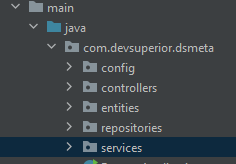

# Modulo Backend

### Recursos usados

No backend usamos o padrao de projeto RestController:

Com os diretorios:


- Entities: Para as classes de Entidade.
   Nela criamos a classe Sale, que representa as vendas de uma certa empresa.  E colocamos os atributos conforme o banco de dados.

- Repositories: Para as interfaces para o banco de dados, extendendo a JPARepository
  
   Na interface foi criado uma requisição que retorna as vendas paginadas por intervalo de data e ordenada pelo atributo Amount de forma descendente
   ````shell
    Page<Sale> findSalesByDateBetweenOrderByAmountDesc(LocalDate min, LocalDate max, Pageable pageable);
   ````
- Services: Para criar os serviços:

  - SalesService para retornar as vendas;    
  - SMSService para envio de SMS;
  
  
- Controller: Uma classe de controller utilizando a anotação @RestController com dois endpoints
    - Um que retorna todas as vendas por determinado periodo 
    - Outro que envia um sms para determinado numero mostrando a venda de determinado periodo.
 
- Config: Uma classe com configuraçao de segurança para o CORS e autenticação de endpoints

Links para documentação oficial dos recursos utilizados nesse projeto:

* [Official Apache Maven documentation](https://maven.apache.org/guides/index.html)
* [Spring Boot Maven Plugin Reference Guide](https://docs.spring.io/spring-boot/docs/2.7.5/maven-plugin/reference/html/)
* [Create an OCI image](https://docs.spring.io/spring-boot/docs/2.7.5/maven-plugin/reference/html/#build-image)
* [Spring Web](https://docs.spring.io/spring-boot/docs/2.7.5/reference/htmlsingle/#web)
* [Spring Security](https://docs.spring.io/spring-boot/docs/2.7.5/reference/htmlsingle/#web.security)
* [Spring Data JPA](https://docs.spring.io/spring-boot/docs/2.7.5/reference/htmlsingle/#data.sql.jpa-and-spring-data)

### Guides

The following guides illustrate how to use some features concretely:

* [Building a RESTful Web Service](https://spring.io/guides/gs/rest-service/)
* [Serving Web Content with Spring MVC](https://spring.io/guides/gs/serving-web-content/)
* [Building REST services with Spring](https://spring.io/guides/tutorials/rest/)
* [Securing a Web Application](https://spring.io/guides/gs/securing-web/)
* [Spring Boot and OAuth2](https://spring.io/guides/tutorials/spring-boot-oauth2/)
* [Authenticating a User with LDAP](https://spring.io/guides/gs/authenticating-ldap/)
* [Accessing Data with JPA](https://spring.io/guides/gs/accessing-data-jpa/)

